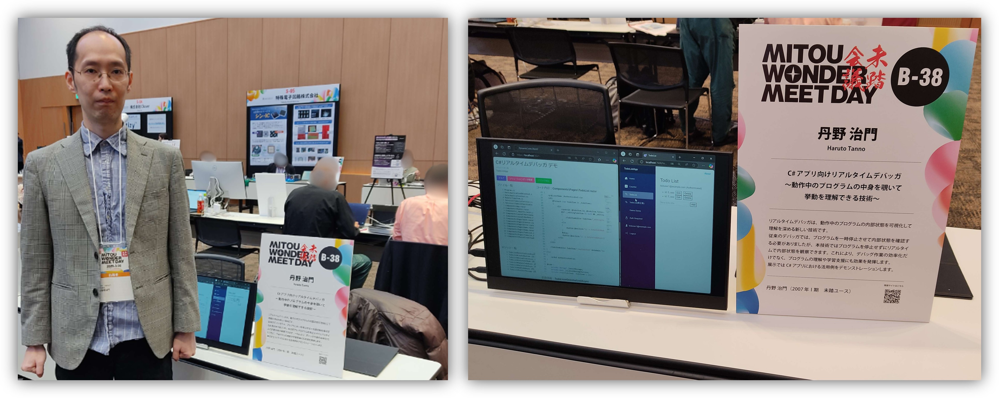

# 未踏会議2025展示

[未踏会議2025](https://www.ipa.go.jp/jinzai/mitou/mitoukaigi/)（2025年3月9日(日)開催）で、以下の内容を展示しました。

## 展示内容

### 題目
「C#アプリ向けリアルタイムデバッガ ～動作中のプログラムの中身を覗いて挙動を理解できる技術～」\
(出展者：[丹野 治門](../../../haruto-tanno/index.md))

### 概要

リアルタイムデバッガは、動作中のプログラムの内部状態を可視化して理解を深める新しい技術です。従来のデバッガでは、プログラムを一時停止させて内部状態を確認する必要がありましたが、本技術ではプログラムを停止せずにリアルタイムで内部状態を観察できます。これにより、デバッグ作業の効率化だけでなく、プログラムの理解や学習支援にも効果を発揮します。展示ではC#アプリにおける活用例をデモンストレーションします。

### 紹介動画
C# ASP.NET Core Blazorで作ったアプリを題材としたリアルタイムデバッガのデモ動画です。
<iframe width="560" height="315" src="https://www.youtube.com/embed/AocAWzGW7oY" frameborder="0" allow="accelerometer; autoplay; clipboard-write; encrypted-media; gyroscope; picture-in-picture" allowfullscreen></iframe>

## 参考
### 未踏事業との関係
以下の未踏ユース成果における「ゲーム向けドメイン特化言語向けリアルタイムデバッガ」が研究開発の出発点となっています。

- 丹野 治門, 唐澤 雄気, 川ノ上 哲規: "みんなで創るRPG", 2007年度Ⅰ期未踏ソフトウェア創造事業未踏ユース部門, 2007.  ([スーパークリエータ認定](https://www.ipa.go.jp/jinzai/mitou/it/qv6pgp000000jo76-att/000050670.pdf))，([成果概要](https://www.ipa.go.jp/archive/files/000006905.pdf)，[成果詳細](https://www.ipa.go.jp/archive/files/000006906.pdf))

### 関連論文
展示技術の関連論文です。

1. Haruto Tanno, Hideya Iwasaki: "Suspend-less Debugging for Interactive and/or Realtime Programs", International Conference on Software Testing, Verification, and Validation (ICST2019), April 2019 ([paper](https://ieeexplore.ieee.org/abstract/document/8730205), [slide](../../../assets/slides/slide(icst2019).pdf), [movie](https://www.youtube.com/watch?v=iI-WG13qx8c)).
1. 丹野 治門，岩崎 英哉: "プログラムを停止させないデバッグを可能とする手法の提案", 日本ソフトウェア科学会 第35回大会講演論文集, 2018年8月 (**学生奨励賞，優秀発表賞**) ([paper](http://jssst.or.jp/files/user/taikai/2018/GENERAL/general4-1.pdf), [slide](../../../assets/slides/slide(jssst2018).pdf))
1. 丹野 治門: "ゲームプログラムに適したリアルタイム性の高いデバッガの提案と実装", 情報処理学会論文誌:プログラミング, Vol. 1, No. 2, pp. 42-56, 2008. ([paper](https://ipsj.ixsq.nii.ac.jp/ej/?action=pages_view_main&amp;active_action=repository_view_main_item_detail&amp;item_id=16436&amp;item_no=1)), ([slide](../../../assets/slides/slide(pro68).pdf)).
1. 丹野 治門: "ゲームシステム記述言語kameTLにおけるリアルタイムデバッグ機構", 情報処理学会第49回プログラミングシンポジウム報告集, pp.17-24, 2008. 2008年1月 (**山内奨励賞**) ([paper](https://ipsj.ixsq.nii.ac.jp/ej/index.php?active_action=repository_view_main_item_detail&item_id=91516&item_no=1&page_id=13&block_id=8))

### 関連動画
- 上述した文献1の論文「Suspend-less Debugging for Interactive and/or Realtime Programs」のデモ動画です。Unityのゲームへリアルタイムデバッガを適用しています。
<iframe width="560" height="315" src="https://www.youtube.com/embed/iI-WG13qx8c" frameborder="0" allow="accelerometer; autoplay; clipboard-write; encrypted-media; gyroscope; picture-in-picture" allowfullscreen></iframe>

### 当日の様子

