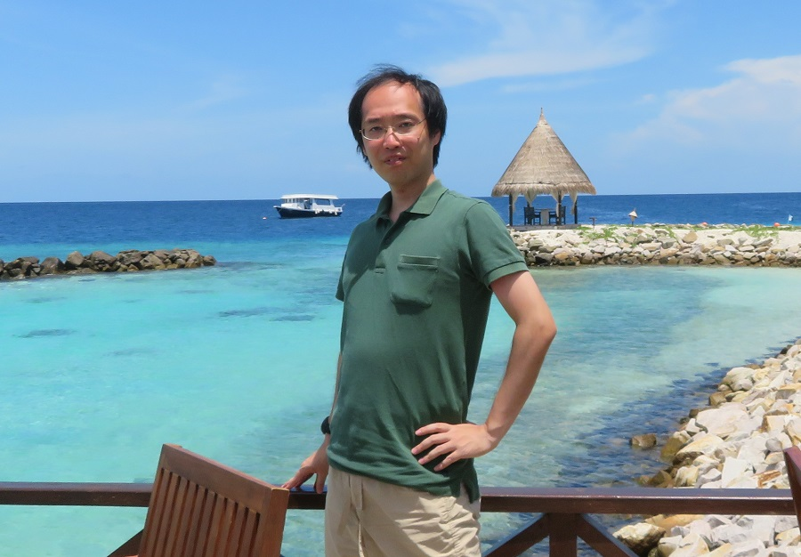

# プログラミング創造研究所

## お知らせ
- 2025年10月1日：丹野が「Microsoft MVP for Developer Technologies（.NET）」を受賞しました。
- 2025年3月9日：[未踏会議2025](https://www.ipa.go.jp/jinzai/mitou/mitoukaigi/)で、丹野が[C#リアルタイムデバッガの展示](contents/20250309-mitoukaigi/index.md)を行いました。

## 研究所について

プログラミング創造研究所は、ソフトウェア開発の未来を探求する個人研究開発機関です。\
開発者の視点から技術的課題に向き合い、「純粋な技術的興味に基づく探求」と「実践的な課題解決」という二つの柱を両輪として活動しています。

## ミッション
- 開発者自身が直面する課題の解決から始め、それを社会的価値へと昇華させる
- プログラミングを楽しく効率的に行える環境を構築する
- 誰もがプログラミングによって創造性を発揮できる技術教育の環境を築く

## アプローチ
- 技術的興味に基づく自由な探求
- 自身が最初のユーザとなる課題解決
- 体系的知識とコミュニティとの対話を通じて、個別解決から普遍価値へと昇華
- 得られた知見の社会還元（情報発信・教育/メンタリング）

## 活動内容
### (1)研究開発
現在、以下の領域で研究開発を進めています：
- (a)プログラム理解・デバッグ支援技術
   - Webやゲームなどインタラクティブ性・リアルタイム性の高いアプリを対象とした、リアルタイムデバッグ技術の検討
- (b)プログラミング学習支援技術
   - プログラミングやローコードアプリの講師・初学者を対象とした指導・学習環境の検討

### (2)技術情報発信
プログラミングの普及と学習支援のために初心者向け技術ブログ執筆、動画による解説を行っています。\
大学で外部講師としてソフトウェア工学に関する講演も実施しています。

### (3)メンタリング
開発者の成長支援のため、少人数制の個別メンタリングを行っています。

## 代表プロフィール

### 丹野 治門 (Haruto Tanno)
**博士（工学）｜Microsoft MVP（Developer Technologies／.NET）｜IPA未踏ユース 天才プログラマ／スーパークリエータ**

ソフトウェアテスト自動化や生成AI応用の研究開発から、社会実装・事業化まで一貫して推進。NTT研究所在籍時には、グループ内外・産学連携プロジェクトを多数主導し、研究成果の事業導入にも幅広く貢献。論文発表100本以上（トップ国際会議含む）、特許出願は国内50件・米国20件以上、国内外での受賞20件以上。

現在は、ソフトウェア開発・生成AI活用のメンター／技術アドバイザーとして、個人を対象とした技術指導・伴走支援を中心に活動。その方々が取り組む実務プロジェクト（企業での開発や起業プロジェクト）に関する技術相談にも対応している。

あわせて、C# を中心とした技術教育・コンテンツ制作（ブログ20,000PV+/月、YouTube登録者3,000+）や、リアルタイムデバッガなどの独自研究開発にも注力。

こうした取り組みを通じて、ソフトウェア開発の高度化と、次世代エンジニアの育成に寄与している。

（経歴・業績の詳細については [こちら](../haruto-tanno/index.md) をご覧ください）

## 仕事の依頼
### 検討可能な事項
- 技術講演（大学外部講師等）
- 専門性の高い技術アドバイザリー
- 少人数制のメンタリング

### ご留意事項
- 現在の研究開発活動との親和性を重視します
- 時期や状況によってお引き受けできない場合がございます

## お問い合わせ
- ｈａｒｕｔｏ．ｔａｎｎｏ．ｐｂ【at】ｇｍａｉｌ．ｃｏｍ
- ※お手数ですが、全角文字を半角文字にした上で【at】を@に置き換えてご利用ください。